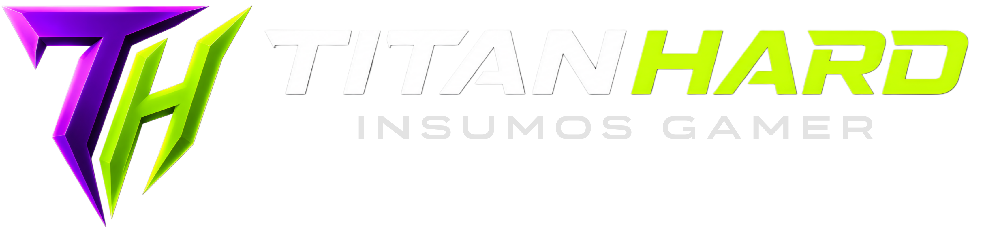

# Titan Hard 🖥️           

## Proyecto final de e-commerce enfocado en productos de hardware y tecnología, desarrollado con HTML, CSS, JavaScript y Bootstrap.
### 🚀 Características
- Catálogo de productos
- Sistema de carrito de compras
- Modal con detalles del carrito
- Diseño responsive
- Navbar interactiva
- Categorías de productos
- Interfaz inspirada en tiendas gamer/tecnología
- Banners promocionales y sliders
- Páginas de login y registro
- Página personalizada de error 404
### 🛠️ Tecnologías Utilizadas
- 

- 

- 

- 

- 

### El proyecto está completamente optimizado y adaptado para:
- Escritorio
- Tablets
- Dispositivos móviles
  
### 🎯 Objetivo
#### El objetivo principal de este proyecto es simular una plataforma moderna de e-commerce tecnológico mientras se practican habilidades de desarrollo frontend, diseño responsive y trabajo en equipo utilizando Git y GitHub.

### 👨‍💻 Desarrollado por:
- Benjamin Federico Mendez
- Jose Alejandro Abella
- Francisco Agustin Delgado Ojeda

### Deploy
- https://titan-hard-project.vercel.app/
  
### 📂 Estructura del Proyecto

- TitanHard/
- │── assets/
- │── css/
- │── pages/
- │── index.html
- │── README.md

  ### Deudas Técnicas
  - Agregar funcionalidades con JavaScript.
  - Pulir algunos diseños.
